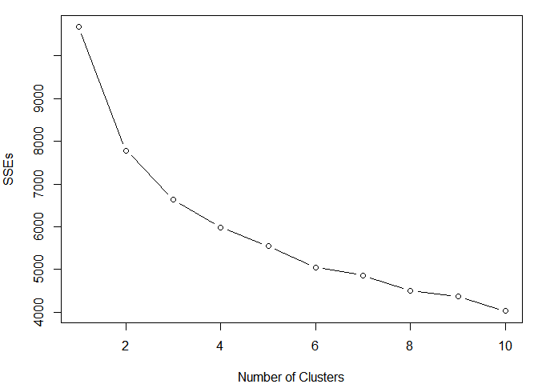

Clustering Songs Based on Musical Qualities From Spotify
================
David Swets
December 11, 2018

In this analysis, let's perform cluster analysis songs from my Spotify playlist library based on the quantitative measures from the Spotify API. In an effort to gather data from a wide variety of genres, I've pulled in playlists containing everything from a collection of the best rap songs from the past 30 years, to a playlist containing 98 famous classical music scores. A couple of the other playlists, such as my most-played songs from 2014 and 2015 contain a wide variety of different genres, so it should be interesting to see how these wildly different styles of music compare based on Spotify's musical features data.

The musical data we'll be looking at gives us all sorts of interesting measures, such as the "danceability", "energy", and "valence" of each song. A full list of the features and greater insight into how they're calculated can be found at this link: <https://developer.spotify.com/documentation/web-api/reference/tracks/get-audio-features/>

First, we'll load the spotifyr package and get Spotify information required to access the API.

``` r
library(spotifyr)
Sys.setenv(SPOTIFY_CLIENT_ID = '8604c19e32d649869e03f09e167b8f01')
Sys.setenv(SPOTIFY_CLIENT_SECRET = 'b9b41901631f477aa989d5ffeecbc2a6')
access_token <- get_spotify_access_token()
```

Now, let's assemble the playlists from my music library and get the audio features for each song on each playlist

``` r
# getting overall playlist info from my Spotify account
playlists <- get_user_playlists("1210694053")

# getting audio features for each playlist
tracks <- get_playlist_audio_features(username = "1210694053", playlist_uris = playlists$playlist_uri)
```

    ## [1] 1
    ## [1] 1
    ## [1] 2
    ## [1] 3
    ## [1] 4
    ## [1] 5
    ## [1] 2
    ## [1] 1
    ## [1] 3
    ## [1] 1
    ## [1] 4
    ## [1] 1
    ## [1] 2
    ## [1] 3
    ## [1] 4
    ## [1] 5
    ## [1] 1
    ## [1] 2
    ## [1] 6
    ## [1] 1
    ## [1] 7
    ## [1] 1
    ## [1] 8
    ## [1] 1

``` r
head(tracks)
```

    ## # A tibble: 6 x 29
    ##   playlist_name playlist_uri playlist_tracks~ playlist_num_tr~ snapshot_id
    ##   <chr>         <chr>        <chr>                       <int> <chr>      
    ## 1 Haleigh Jams  35CbrjPCXit~ https://api.spo~              417 NDI0LDRlOD~
    ## 2 Haleigh Jams  35CbrjPCXit~ https://api.spo~              417 NDI0LDRlOD~
    ## 3 Haleigh Jams  35CbrjPCXit~ https://api.spo~              417 NDI0LDRlOD~
    ## 4 Haleigh Jams  35CbrjPCXit~ https://api.spo~              417 NDI0LDRlOD~
    ## 5 Haleigh Jams  35CbrjPCXit~ https://api.spo~              417 NDI0LDRlOD~
    ## 6 Haleigh Jams  35CbrjPCXit~ https://api.spo~              417 NDI0LDRlOD~
    ## # ... with 24 more variables: playlist_img <chr>, track_name <chr>,
    ## #   track_uri <chr>, artist_name <chr>, album_name <chr>, album_img <chr>,
    ## #   track_added_at <dttm>, track_popularity <int>,
    ## #   track_preview_url <chr>, track_open_spotify_url <chr>,
    ## #   danceability <dbl>, energy <dbl>, key <chr>, loudness <dbl>,
    ## #   mode <chr>, speechiness <dbl>, acousticness <dbl>,
    ## #   instrumentalness <dbl>, liveness <dbl>, valence <dbl>, tempo <dbl>,
    ## #   duration_ms <dbl>, time_signature <dbl>, key_mode <chr>

Now, we'll retain only the numeric features, and we'll also scale all the variables before clustering to make sure each feature is being considered equally.

``` r
# extracting only the numeric variables
num_track_features <- tracks[, unlist(lapply(tracks, is.numeric))]

# removing the first two and last 2 columns from this as these columns are not really approproiate/relevant for comparison
num_track_features <- num_track_features[, -c(1:2, 12:13)]

# scaling variables in preparation for clustering
scale_num_track_features <- data.frame(scale(num_track_features))
```

Let's do some clustering. First, we'll determine the optimal number of clusters from the scree plot.

``` r
fit <- kmeans(scale_num_track_features, 3)


SSEs <- rep(NA,10) # a vector to store SSEs for different k's
SSEs[1] <- fit$totss # total SSE if no clustering is done
for(k in 2:10){
  fit <- kmeans(scale_num_track_features,k)
  SSEs[k] <- fit$tot.withinss
}
par(mar=c(4,4,1,1))
plot(1:10,SSEs,type="b",xlab="Number of Clusters")
```



We'll go with 4 overall clusters distinct clusters, since adding additional ones has the potential to convolute interpretable results and stops adding value after about 4.

``` r
fit <- kmeans(scale_num_track_features, 4)
```

We'll pull raw values based on cluster results to ease in comparison and interpretation, and let's print out the means for each feature for each cluster.

``` r
cluster_info <- data.frame(num_track_features, fit$cluster)

(cluster_means <- aggregate(cluster_info, list(cluster_info$fit.cluster), mean)[,-1])
```

    ##   danceability    energy   loudness speechiness acousticness
    ## 1    0.5450268 0.8080805  -5.477696  0.06030608   0.09425437
    ## 2    0.3930513 0.2630335 -17.673177  0.04305310   0.84340354
    ## 3    0.6094211 0.7632105  -6.048496  0.22902632   0.12070486
    ## 4    0.7967337 0.6442193  -7.384214  0.19773420   0.13105550
    ##   instrumentalness  liveness   valence    tempo fit.cluster
    ## 1       0.06539865 0.1661882 0.5917716 132.0876           1
    ## 2       0.63930869 0.1605274 0.3116973 112.8455           2
    ## 3       0.01748770 0.5315113 0.5237023 133.8510           3
    ## 4       0.02741703 0.1586352 0.6205277 106.5442           4

``` r
full_cluster_data <- data.frame(fit$cluster, tracks[,-c(2:6, 8, 11:12, 14:15)])
```

Here we can examine the types of songs that are falling into each cluster as well as what playlist they're coming from.

``` r
songs1 <- full_cluster_data[full_cluster_data$fit.cluster == 1, 2:4]
songs2 <- full_cluster_data[full_cluster_data$fit.cluster == 2, 2:4]
songs3 <- full_cluster_data[full_cluster_data$fit.cluster == 3, 2:4]
songs4 <- full_cluster_data[full_cluster_data$fit.cluster == 4, 2:4]
```

Cluster 1 songs have the highest level of energy as well as the lowest level of acousticness of any of the clusters. It also has the highest tempo by a wide margin, indicating that these are the heavier and more upbeat punk/blues rock-driven songs in the analysis.

Cluster 2 has the lowest liveness of any of the clusters, referring to the likelihood that the song was performed in front of an audience. This cluster also has by far the highest valence, which represents a way to quantify the happiness of the song. A lot of songs in this cluster fall under the alternative pop/rock umbrella, so the stereotypically positive and carefree style of these songs shines through here.

Cluster 3 seems to be the much lower energy and quieter songs with high levels of acousticness. Almost all of the songs from the "Classical" playlist (all but 1!!) as well as general acoustic songs are found here. These songs, lots of them instrumental classical songs, also have by far the highest level of instrumentalness of any of the clusters. This group also has the lowest valence of any cluster, indicating that these songs can generally be classified as more somber or depressed (again, consistent with some of the classical music stereotypes of being dull or less-energetic).

Cluster 4 has the highest liveness and lowest tempo of any of the clusters. Its average acousticness is extremely low (3rd lowest of the 4 and only about .02 greater than the lowest), but it has the second highest energy level of any of the clusters. It also has the highest level of loudness of any of the clusters. These characteristics seem to indicate that these songs are slightly more electric and more energetic than most of the others, but also at a lower tempo. A lot of rap/hip-hop and other beat-driven songs find their way into this cluster.

Overall, it seems that the rap/hip hop songs were typically captured in Cluster 4. The alternative rock and classic rock tunes tended to fall more in clusters 1 and 2, but were less concentrated than some of the other genres. Also, while most of the classical songs ended up being grouped together (no surprise there), it's interesting that the "Classical Cluster" (Cluster 3) also captured a lot of generally mellow acoustic songs, indicating that there might be more similarity between the music features of modern acoustic and folk artists (Bob Dylan, The Avett Brothers, etc) and that of the likes of Beethoven and Mozart than you might think...
