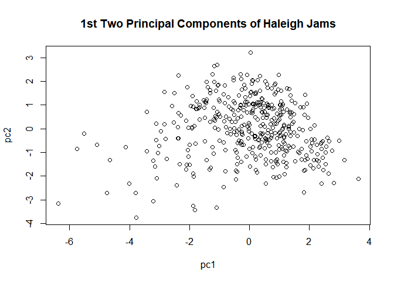
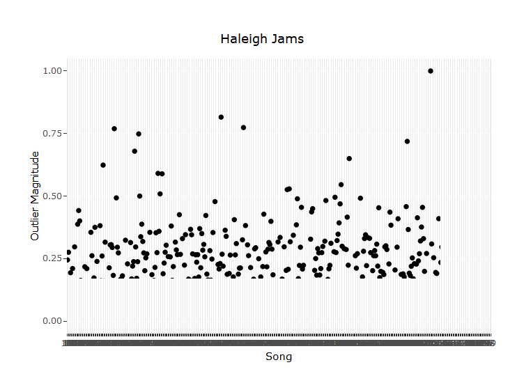

Detecting Anomalous Songs From a Spotify Playlist
================
David Swets
December 10, 2018

Let's perform Singular Value Decomposition on songs from my "Haleigh Jams" Spotify playlist to see if there are any songs here that are significantly different from the other songs on this playlist. "Haleigh Jams" is a playlist of songs I made for my girlfriend last summer based on songs I thought she would enjoy, so it would be interesting to see what the typical profile of these songs looks like and if there are any that differ significantly from the rest of the pack.

The musical data we'll be looking at gives us all sorts of interesting measures, such as the "danceability", "energy", and "valence" of each song. A full list of the features and greater insight into how they're calculated can be found at this link: <https://developer.spotify.com/documentation/web-api/reference/tracks/get-audio-features/>

First, we'll need to load up our packages and the Spotify credentials.

``` r
library(spotifyr)
library(ggplot2)
library(plotly)
```

    ## 
    ## Attaching package: 'plotly'

    ## The following object is masked from 'package:ggplot2':
    ## 
    ##     last_plot

    ## The following object is masked from 'package:stats':
    ## 
    ##     filter

    ## The following object is masked from 'package:graphics':
    ## 
    ##     layout

``` r
Sys.setenv(SPOTIFY_CLIENT_ID = '8604c19e32d649869e03f09e167b8f01')
Sys.setenv(SPOTIFY_CLIENT_SECRET = 'b9b41901631f477aa989d5ffeecbc2a6')
access_token <- get_spotify_access_token()
```

Now, let's scrape the song data and extract only the columns we want to throw into the SVD algorithm.

``` r
# getting overall playlist info from my Spotify account
playlists <- get_user_playlists("1210694053")

# getting audio features for Haleigh Jams playlist
haleigh <- get_playlist_audio_features(username = "1210694053", playlist_uris = "35CbrjPCXitWYZosBCPib6")
```

    ## [1] 1
    ## [1] 1
    ## [1] 2
    ## [1] 3
    ## [1] 4
    ## [1] 5

``` r
haleigh_track_features <- haleigh[, unlist(lapply(haleigh, is.numeric))]

# removing the first two and last 2 columns from this as these columns are not really approproiate/relevant for comparison
haleigh_track_features <- haleigh_track_features[, -c(1:2, 12:13)]

# scaling variables in preparation for SVD
scaleigh <- scale(haleigh_track_features)
```

And now, on with the SVD show!

``` r
SVD <- svd(scaleigh)

u <- SVD$u
d <- SVD$d
v <- SVD$v


pcs = as.matrix(scaleigh)%*%v[,1:2]
pcs = data.frame("pc1" = pcs[,1], "pc2" = pcs[,2])


plot(pcs, main = "1st Two Principal Components of Haleigh Jams")
```



In order to create a measure of "outlyingness," let's calculate the Euclidean Distance between the mean value of each of the new principal components to the values of each point on the new values (from the plot above).

``` r
pc_means <- colMeans(pcs)


euc_dist <- c()
for (i in 1:nrow(pcs)) {
  
  euc_dist[i] <- sqrt((pcs[i,1] - pc_means[1])^2 + (pcs[i,2] - pc_means[2])^2)
  
}

# dividing our euc distance by the max distance to calculate an outlier score
outlier_magnitude <- euc_dist / max(euc_dist)
```

In order to determine if a song is an "outlier," we'll establish the outlier cutoff threshold based on our outlier magnitude score. For now, let's use 4 standard deviations from the mean (this can easily be changed later if need be). The features of the outliers can be compared against the means of the numeric columns in the analysis to highlight why the outlying songs were determined to be different.

``` r
full_haleigh_data <- data.frame(haleigh[,-c(2:6, 8, 11:12, 14:15)], pcs, euc_dist, outlier_magnitude)


outlier_cutoff <- c(mean(full_haleigh_data$outlier_magnitude) - 4 * sd(full_haleigh_data$outlier_magnitude),
                    mean(full_haleigh_data$outlier_magnitude) + 4 * sd(full_haleigh_data$outlier_magnitude))


# songs deemed to be significantly different from the rest 
(outliers <- full_haleigh_data[which(full_haleigh_data$outlier_magnitude < outlier_cutoff[1] | full_haleigh_data$outlier_magnitude > outlier_cutoff[2]),])
```

    ##     playlist_name               track_name       artist_name
    ## 45   Haleigh Jams     First Day Of My Life       Bright Eyes
    ## 235  Haleigh Jams Piazza, New York Catcher Belle & Sebastian
    ##                       album_name track_popularity danceability energy key
    ## 45  I'm Wide Awake, It's Morning               68        0.468  0.201   E
    ## 235    Dear Catastrophe Waitress               47        0.618  0.305  D#
    ##     loudness  mode speechiness acousticness instrumentalness liveness
    ## 45   -17.024 major      0.0388        0.915         8.28e-05   0.0952
    ## 235  -15.107 minor      0.0372        0.813         0.00e+00   0.1000
    ##     valence   tempo duration_ms time_signature key_mode       pc1
    ## 45    0.383  94.422      188800              4  E major -6.387123
    ## 235   0.833 105.714      183493              4 D# minor -5.751542
    ##            pc2 euc_dist outlier_magnitude
    ## 45  -3.1708899 7.130910          1.000000
    ## 235 -0.8523193 5.814351          0.815373

``` r
colMeans(haleigh_track_features)
```

    ##     danceability           energy         loudness      speechiness 
    ##       0.55233094       0.77034053      -5.89841247       0.05497866 
    ##     acousticness instrumentalness         liveness          valence 
    ##       0.12416397       0.07007903       0.18681463       0.58691607 
    ##            tempo 
    ##     126.08322782

We can visualize all of these songs according to their level of outlyingness using an interactive plot from the plotly package

``` r
p <- ggplot(full_haleigh_data, aes(x = row.names(full_haleigh_data), y = outlier_magnitude)) + xlab("Song") + ylab("Outlier Magnitude") + ggtitle("Haleigh Jams") +
  geom_point() 

text <- paste(full_haleigh_data$track_name, full_haleigh_data$artist_name, sep = " ")

plot_text = paste(full_haleigh_data$track_name, "-", full_haleigh_data$artist_name)
pp = ggplotly(p)
style(pp, text = plot_text, hoverinfo = "text")
```



It appears that "First Day of My Life" by Bright Eyes is the most unique song in this entire playlist, followed closely by Belle & Sebastian's "Piazza, New York Catcher." This appears to be the driven by the enormously high levels of acousticness (.915 and .813 vs .124) as well as the abnormally low levels of energy (.201 and .305 vs .770) seen in both of these songs. Both of these songs could safely be described as being quite mellow, so these values make sense, particularly compared to the rest of the songs in the playlist. Using a cutoff value of 4 standard deviations from the mean, these are the only two songs in the playlist determined to be outliers, but the interactive outlier magnitude plot is useful in uncovering the more "subtle outliers." This is a fun analysis to explore using your own musical tastes as well to see if there are songs in your library that are really quite different from what you would normally listen to or enjoy.
